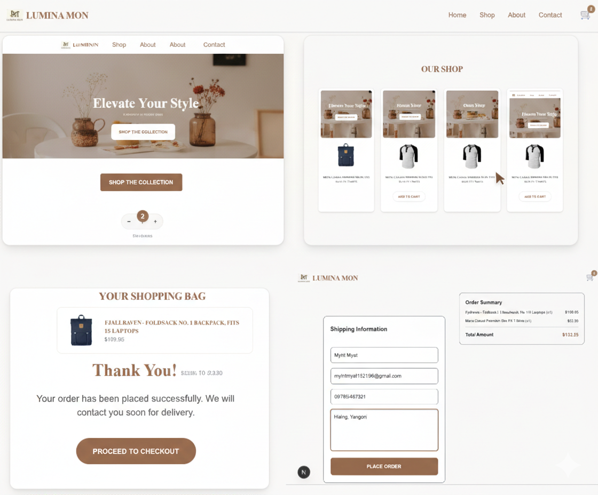

# 🚀 Lumina Mon E-commerce

A sophisticated and modern e-commerce frontend designed for a premium shopping experience. Featuring a clean minimalist UI, seamless navigation, and a fully integrated shopping cart system.

## ✨ Key Features
* **🛒 Shopping Cart System:** Complete flow from adding items to cart management and final checkout.
* **📱 Fully Responsive:** Optimized for all devices, from mobile phones to desktops.
* **🎨 Elegant UI:** Custom-themed design with a focus on modern aesthetics and readability.
* **⚡ Fast Performance:** Built with Next.js for server-side rendering and quick page transitions.
* **📧 Contact & Support:** Integrated contact form for user inquiries.

## 🛠️ Tech Stack
**Language:** TypeScript
* **Frontend:** Next.js (App Router), React.js
* **Styling:** Tailwind CSS (Custom Color Palette)
* **State Management:** React Hooks (Context API/useState)
* **Icons & Assets:** Lucide React / Custom SVG Assets

## 🚀 Live Demo
[View Live Demo on Vercel]((https://lumina-mon-ecommerce.netlify.app/))

## 🎥 Preview




## 📂 Project Structure
* `/shop`: Product listing and category views.
* `/cart`: Real-time cart calculation and item management.
* `/checkout`: Shipping information and order summary flow.
* `/contact`: Customer support interface.

This is a [Next.js](https://nextjs.org) project bootstrapped with [`create-next-app`](https://github.com/vercel/next.js/tree/canary/packages/create-next-app).

## Getting Started

First, run the development server:

```bash
npm run dev
# or
yarn dev
# or
pnpm dev
# or
bun dev
```

Open [http://localhost:3000](http://localhost:3000) with your browser to see the result.

You can start editing the page by modifying `app/page.js`. The page auto-updates as you edit the file.

This project uses [`next/font`](https://nextjs.org/docs/app/building-your-application/optimizing/fonts) to automatically optimize and load [Geist](https://vercel.com/font), a new font family for Vercel.

## Learn More

To learn more about Next.js, take a look at the following resources:

- [Next.js Documentation](https://nextjs.org/docs) - learn about Next.js features and API.
- [Learn Next.js](https://nextjs.org/learn) - an interactive Next.js tutorial.

You can check out [the Next.js GitHub repository](https://github.com/vercel/next.js) - your feedback and contributions are welcome!
